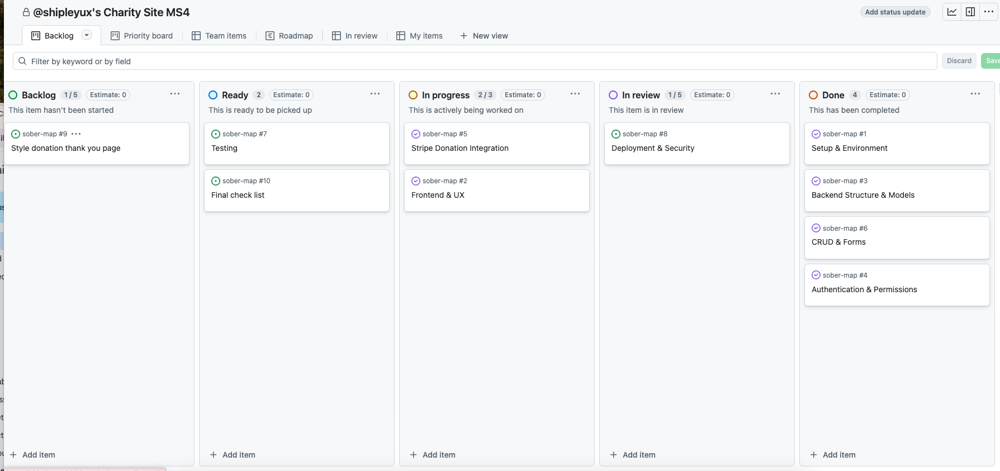

# Swansea Women's Aid Website

A full-stack charity website developed for Swansea Women’s Aid, built as part of the Level 5 Diploma in Web Application Development (Unit 4). This platform provides support and information for women and children experiencing domestic abuse, allowing users to read the latest news, donate securely, and get in touch through a simple contact form.

The site is designed with accessibility, user experience, and scalability in mind. It includes a secure CMS for staff to manage blog posts and a donation system integrated with Stripe. The project demonstrates full CRUD functionality, user authentication, relational database use, and clean, maintainable code.

---

### 🔐 Admin Login for Testing

To access the admin-only features during assessment:

- **Username:** `Admin`  
- **Password:** `Messages1`

## Table of Contents

- [Overview](#overview)
- [Scope](#scope)
- [Market Research](#market-research)
- [Business & Marketing Plan](#business-&-marketing-plan)
- [UX Design](#ux-design)
- [Features](#features)
- [Database Schema](#database-schema)
- [Technologies Used](#technologies-used)
- [Installation & Deployment](#installation--deployment)
- [Testing](#testing)
- [Bugs & Issues](#bugs--issues)
- [Future Enhancements](#future-enhancements)


## Scope

This project involved designing and developing a new website for Swansea Women’s Aid, with the aim of creating a modern, user-friendly platform that better serves women and families affected by domestic abuse. The charity specifically requested a website that would be:

- Easy to navigate, especially for users in crisis  
- Accessible on all devices  
- Clear in communicating available services and support options  
- Simple for staff to update with news and blog posts  

The scope included building a fully responsive front end with accessible markup and intuitive page layouts, as well as integrating backend functionality using Django to enable dynamic content management. Key features include:

- A secure, easy-to-use donation system  
- A contact form to allow women to reach out for support  
- A blog/news section staff can manage through the admin panel  

The design prioritised clarity, calmness, and trust, in line with the sensitive nature of the content and the needs of the users.

## Market Research

As part of the research process, I used Refuge’s website as a key case study. I reviewed their layout, navigation, and key features, including how they structured their support services, crisis messaging, and user pathways. This helped inform decisions about clarity, accessibility, and tone.

In addition, I conducted informal user interviews to understand real user needs. A key finding was that many women were unsure whether they were experiencing domestic abuse, and were also unclear on what services were actually available to them.

In response to this, I made it a priority to:
- Clearly signpost the different types of support Swansea Women’s Aid offers
- Include a section on recognising the signs of domestic abuse
- Ensure the language and design felt safe, reassuring, and easy to understand

This user-centered approach directly shaped both the content strategy and layout of the site.

## Business & Marketing Plan

This project was developed for Swansea Women’s Aid, a local charity supporting women and children affected by domestic abuse. The primary goal was to create a website that reflects the professionalism and trustworthiness of the organisation, while making it easier for people to access support or engage with the charity.

As part of the planning process, I conducted a stakeholder interview with the charity's leadership team. Together, we identified three key user groups:

1. **Women in need of support** – the top priority. These users need fast, clear access to help, reassurance, and information.
2. **Donors and funders** – individuals or organisations who want to support the charity through financial contributions.
3. **Volunteers and job seekers** – people looking to get involved through employment or volunteering opportunities.

The site’s layout and messaging were designed to serve each of these groups in priority order, with the homepage and main navigation focused on access to help, followed by donation and involvement opportunities.

A key business objective was to improve funding outcomes. The site supports this by:

- Presenting a professional, trustworthy image to potential funders and partners  
- Making it easy to donate through an integrated Stripe payment system  
- Clearly outlining the organisation’s impact, values, and services  
- Providing up-to-date news and stories that funders can refer to in grant applications or due diligence processes  

The website will also be supported by ongoing **social media outreach** and **local events**, both of which play an important role in community engagement and fundraising. For this reason, the **news and events section** was a key feature — allowing staff to easily announce upcoming campaigns, workshops, and public activities to their audience in real time.

## Key Performance Indicators (KPIs)

To help Swansea Women’s Aid track how well the new site is performing, I identified a few key areas they could keep an eye on over time:

<details>
<summary>🎯 <strong>User Engagement</strong></summary>

- Are people spending longer on important pages like “Get Help” or “Signs of Abuse”?  
- Is the bounce rate improving (i.e. are fewer people leaving after viewing just one page)?  
- Are more people using the contact form to reach out?  

</details>

<details>
<summary>💸 <strong>Donations & Fundraising</strong></summary>

- Has the number of online donations increased since launching the new site?  
- How many people are visiting the donation page?  
- What percentage of visitors actually go on to donate?  

</details>

<details>
<summary>📣 <strong>Communication & Awareness</strong></summary>

- Are staff using the news section to keep the community updated?  
- Are news posts being viewed and shared?  
- Is more traffic coming from social media or email campaigns?  

</details>

<details>
<summary>🛠️ <strong>Ease of Use for Staff</strong></summary>

- Are staff able to update content like news and services without needing developer help?  
- Is it saving them time compared to the old site?  
- Are they getting fewer tech-related issues or support requests?  

</details>

These KPIs should give the charity a good sense of how the site is supporting users, making fundraising easier, and reducing workload for the team.

## 🛠️ Development Plan

To ensure the project stayed on track and met the needs of Swansea Women’s Aid, I followed a process from initial research through to development and deployment.

I organised my research using google calender appointments and google sheets and for dveeloptment I used a **GitHub Projects board** to organise and prioritise tasks, which allowed me to track progress across all development stages. You can view it here:  
<details>
<summary>Project Board</summary>



</details>
Off the back of my research I  created wireframes and design layouts in Figma to plan the user interface before development began.  
<details>
<summary>Figma Designs</summary>


</details>


---

### 📆 Timeline

```text
Stakeholder Interviews
     │
     ▼
User Research on Existing Site
     │
     ▼
Figma Wireframes & Design
     │
     ▼
Presentation of Designs to Stakeholders
     │
     ▼
Full Stack Development in Django
     │
     ▼
Stripe Integration and Heroku Deployment
     │
     ▼
Testing and collate README doc
     │
     ▼
Submission

``````

## User Research

To understand user needs more deeply, I carried out informal user testing and interviews with both Swansea Women’s Aid staff and women who had used or would potentially use the service.

### Key findings:
- Many women weren’t sure whether what they were experiencing qualified as domestic abuse
- Some were unaware of the full range of services available to them
- Staff wanted a simpler way to update the site, post news, and promote events internally

These insights shaped several design decisions:
- A section was added to help users recognise the signs of domestic abuse
- Service offerings were made clear and easy to find on the homepage and navigation
- A custom news/blog feature was developed to empower staff to update the site without needing developer support
- The overall tone, layout, and design were chosen to feel calm, accessible, and supportive

This user-led approach ensured the site prioritised clarity, trust, and empowerment — all critical for the charity’s audience.

## 🎯 User Experience (UX)

### 🔍 Research-Driven Design

The UX design for this site was shaped by a stakeholder interview and informal user research involving both staff and service users. During this process, several key issues with the existing site were raised:

- Women in need weren’t sure if they qualified for support, or which services were available to them.
- The content was hard to navigate and lacked clear structure.
- Staff couldn’t easily update information, share news, or promote events.
- The visual tone didn’t reflect the warmth, calmness, or professionalism of the organisation.

These findings helped define the user needs and guided the redesign around **clarity, accessibility, and trust**.

---


<details>
<summary><strong>User Stories</strong></summary>

| As a...           | I want to...                                      | So that I can...                                  |
|------------------|---------------------------------------------------|---------------------------------------------------|
| Vulnerable user  | Access help quickly                               | Feel safe and supported                          |
| Public visitor   | Read about types of abuse                         | Understand the signs and know how to help others |
| Staff member     | Log in securely                                   | Update the site with latest news and info        |
| Donor            | Make a secure donation online                     | Support the charity’s mission                    |
| Volunteer        | See how I can get involved                        | Offer my time and skills to help                 |

</details>

### 🧭 Information Architecture (IA)

The site’s structure was deliberately simplified to make it easier for users to find what they need quickly — especially those in moments of stress. The **main navigation** reflects the three core user groups identified in the stakeholder interview: service users, supporters, and volunteers.

**Primary navigation includes:**
- About Domestic Abuse
- About us
- Contact us
- Latest News
- Donate

Content is prioritised to first support **women in crisis**, then **donors**, and finally **people looking to get involved**.

---

### Page Layout & Content Structure

The homepage follows a clear visual hierarchy and intuitive flow:

1. **Crisis message bar** — top priority with helpline number and a “hide this site” button for safety
2. **Headline & subheadline** — summarising the organisation’s purpose in a reassuring, empowering tone
3. **Primary CTAs** — “Get Help” and “Learn More” for immediate user action
4. **Essential services preview** — showcasing the charity’s three core offerings with brief explanations
5. **Educational content** — section on recognising abuse and accessing help, designed to reduce confusion and stigma
6. **Donation & involvement section** — inviting supporters to help make a difference
7. **Latest news carousel** — helps keep the site dynamic and up to date, and shows the charity’s ongoing activity
8. **FAQs** — addresses common concerns and supports users who need more guidance

The layout uses generous spacing, calm colours, soft rounded corners, and highly readable typography — all chosen to create a sense of safety and ease.

<summary>Figma Designs</summary>


</details>

### Staff Login Placement

I moved the login link from the top navigation to the footer because the login area is only used by Swansea Women’s Aid staff. This helped simplify the main navigation and reduce any confusion for public users who don’t need to access it.

---

## Testing & Bug Log
[View Testing Documentation](testing.md)

### Future Enhancements

Several UX improvements were identified for future consideration:

- **Multilingual support** — the ability to switch to Welsh or other languages for accessibility
- **Quick exit feature** — currently in place, but could be enhanced with localStorage to improve speed
- **Site-wide search** — to help users quickly locate specific content or support pages
- **Backend CMS features** — allowing staff to manage services, news, and events even more efficiently

---

By combining user research with clear IA, accessible layout decisions, and inclusive design principles, the new site puts the needs of women first while still supporting the charity’s long-term engagement and fundraising goals.


## Features

## 🧩 Data Models & Entity Relationship Diagram

<details>
<summary>Click to view the Entity Relationship Diagram</summary>


> **Note:** The ERD includes an `email` field on the `User` model. This is part of Django’s built-in authentication system. However, this project does not use email for user login or account creation.

</details>

The application uses a PostgreSQL database with three custom models: `Post`, `Donation`, and `ContactMessage`.

---

### 📝 Post Model

| Field        | Type               | Description                                 |
|--------------|--------------------|---------------------------------------------|
| `title`      | CharField          | Title of the blog post                      |
| `slug`       | SlugField (unique) | URL-friendly identifier                     |
| `content`    | TextField          | Body content of the post                    |
| `created_on` | DateTimeField      | Timestamp when post was created             |
| `author`     | ForeignKey to User | Link to Django’s built-in user model        |

Posts are ordered by `created_on` in descending order. Each post has a dynamic detail URL generated by its slug.

---

### 💳 Donation Model

| Field        | Type              | Description                                      |
|--------------|-------------------|--------------------------------------------------|
| `name`       | CharField         | Name of the donor                                |
| `email`      | EmailField        | Optional email address of the donor              |
| `amount`     | DecimalField      | Donation amount in GBP                           |
| `message`    | TextField         | Optional message left by the donor               |
| `timestamp`  | DateTimeField     | Time donation was made (default: now)            |

This model stores Stripe-processed donations for internal record-keeping.

---

### 📬 ContactMessage Model

| Field          | Type          | Description                                   |
|----------------|---------------|-----------------------------------------------|
| `name`         | CharField     | Name of the user submitting the message       |
| `email`        | EmailField    | Email address of the user                     |
| `message`      | TextField     | The message content                           |
| `submitted_at` | DateTimeField | Automatically set when message is submitted   |

Messages are handled via the site’s contact form and stored for admin review.


## CRUD Functionality & Admin Access

This project includes full CRUD (Create, Read, Update, Delete) functionality, implemented specifically for Swansea Women’s Aid staff to manage the site’s news section.

- **Create**: Staff users can log in and add new blog posts via a secure form.
- **Read**: All visitors can view published posts on the news page.
- **Update**: Staff can edit existing posts through a staff-only interface.
- **Delete**: Staff can also delete posts when necessary, with confirmation.

Access to these features is restricted using Django’s built-in authentication system and role-based permissions. Only users with staff status (`is_staff = True`) can create or manage posts.

To keep the main navigation clean and user-focused, the **staff login link is placed discreetly in the footer** of the site.

### 🔐 Admin Login for Testing

To access the admin-only features during assessment:

- **Username:** `Admin`  
- **Password:** `Messages1`

> *Please note: This account has staff permissions and can create, edit, and delete blog posts. Use responsibly.*

- Responsive layout for desktop and mobile
- Informational homepage with support messaging
- Blog section with CRUD functionality for staff
- Secure login and logout via Django Allauth
- Donation form integrated with Stripe
- Contact form with success message confirmation
- Custom admin panel with user permissions
- 404 and 500 error pages

## Technologies Used

- Django 4.2 (Python 3.11)
- PostgreSQL (via Heroku)
- Bootstrap 5
- HTML5 / CSS3 
- Stripe API (for payments)
- Git & GitHub
- Heroku (deployment)

## Installation & Deployment

### Local Installation

To run this project locally:

1. **Clone the repository**:
    ```bash
    git clone https://github.com/yourusername/charity-site-ms4.git
    cd charity-site-ms4
    ```

2. **Create a virtual environment** and activate it:
    ```bash
    python -m venv env
    source env/bin/activate  
    ```

3. **Install project dependencies**:
    ```bash
    pip install -r requirements.txt
    ```


4. **Create a `.env` file** in the root directory and add the following environment variables:

```env
SECRET_KEY=your_django_secret_key
STRIPE_SECRET_KEY=your_stripe_secret_key
DEBUG=True

These variables are used to keep sensitive information out of the codebase. The `.env` file is included in `.gitignore` and not committed to version control.

- `SECRET_KEY`: Required by Django for cryptographic signing and session management.
- `STRIPE_SECRET_KEY`: Used for processing payments securely via Stripe.
- `DEBUG`: Set to `True` in development. This should be overridden to `False` in production using Heroku config vars.
```

5. **Apply database migrations** and run the server:
    ```bash
    python manage.py migrate
    python manage.py runserver
    ```

---

## Deployment (Heroku)

The live site is deployed on [Heroku](https://swansea-womens-aid.herokuapp.com/), using PostgreSQL and Stripe integration for donation processing.

### Deployment Steps

1. **Created a Heroku app**:
    ```bash
    heroku create swansea-womens-aid
    ```

2. **Provisioned a PostgreSQL database** using Heroku's add-ons:
    ```bash
    heroku addons:create heroku-postgresql:hobby-dev
    ```

3. **Configured environment variables** in Heroku to keep sensitive information secure. The following variables were added via the Heroku dashboard:
    - `SECRET_KEY` – Django secret key
    - `STRIPE_SECRET_KEY` – Stripe test secret key used for donation payments

4. **Pushed the code to Heroku**:
    ```bash
    git push heroku main
    ```

5. **Applied migrations** and optionally created a superuser:
    ```bash
    heroku run python manage.py migrate
    heroku run python manage.py createsuperuser
    ```

6. **Disabled debug mode** by setting:
    - `DEBUG = False` in environment variables
    - Secret keys are **not** committed to the repo and are stored securely

---

### Static Files

- Static files are collected and served using **WhiteNoise**:
    ```bash
    python manage.py collectstatic
    ```

---

## 💬 Personal Reflection

As a student developer, I’ve poured my energy into understanding and building out the core backend functionality of this project. While I’m aware the site still needs significant styling work to feel fully polished, my priority throughout has been ensuring that the core features — including the database, CRUD operations, Stripe integration, and admin tools — are functional, secure, and aligned with the assessment criteria.

This has been a real learning journey, and backend development has been the area I found most challenging. I made the conscious decision to focus on functionality first, knowing I can return to refine the design with more confidence once the foundations are solid.

I will continue working on this project after submission to ensure it is fully styled and visually aligned with the needs of the charity and its users. I’m proud of the progress so far and excited to keep improving the site.


## 🙏 Acknowledgements & Accreditations

This project was completed as part of the **Level 5 Diploma in Web Application Development (Unit 4)**.

### 👨‍🏫 Special Thanks

- Huge thanks to **Spencer Barribal**, my mentor, for his support and guidance throughout this project.
- I’d also like to acknowledge **Code Institute** – I used their course materials and sample projects for reference, guidance, and inspiration, especially when learning how to implement Django views, CRUD functionality, and Stripe integration.

### 🧠 Content & Assets

- **Text content** on the site was primarily generated with the assistance of AI, then edited for tone, clarity, and suitability for the Swansea Women’s Aid audience.
- **Photography** is sourced from [Unsplash](https://unsplash.com/), a free library of high-quality images, and used under their open license.

---

This project represents a major step forward in my backend development journey. While there’s still styling work to be done, I’m proud of the functional foundation I’ve built and look forward to continuing to enhance the site after submission.
