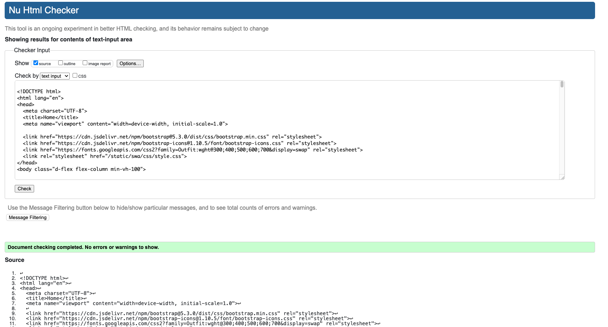
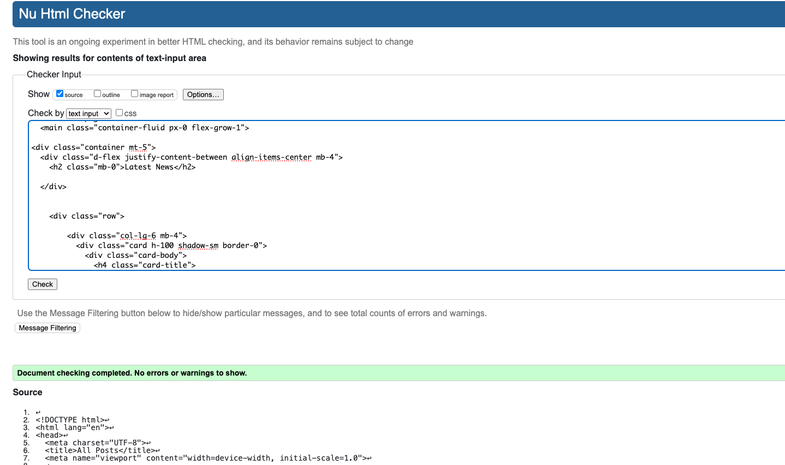
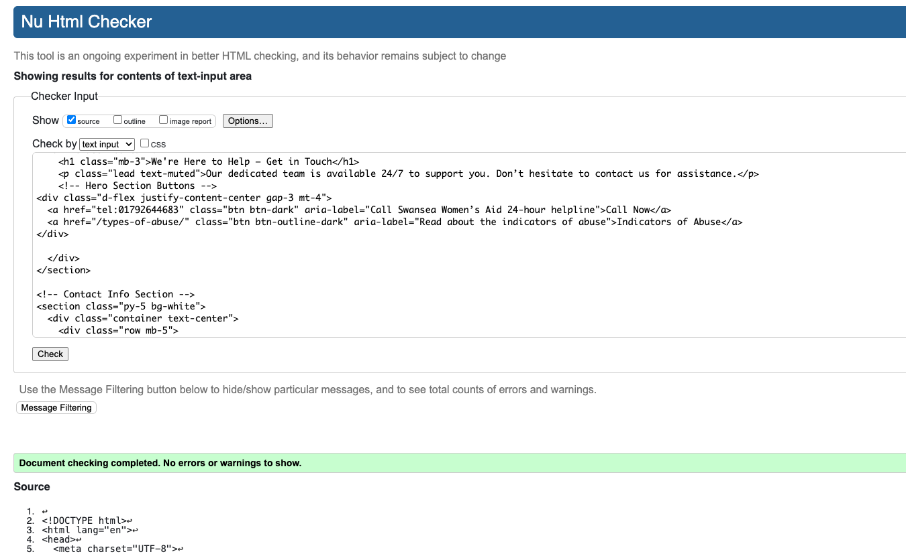
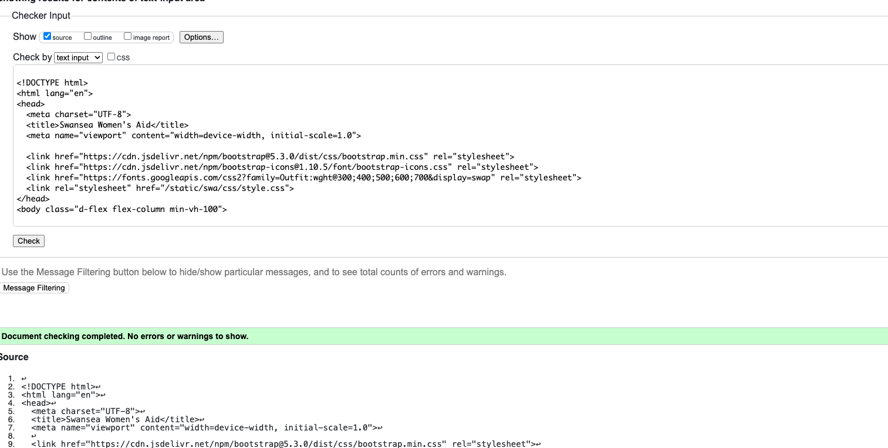
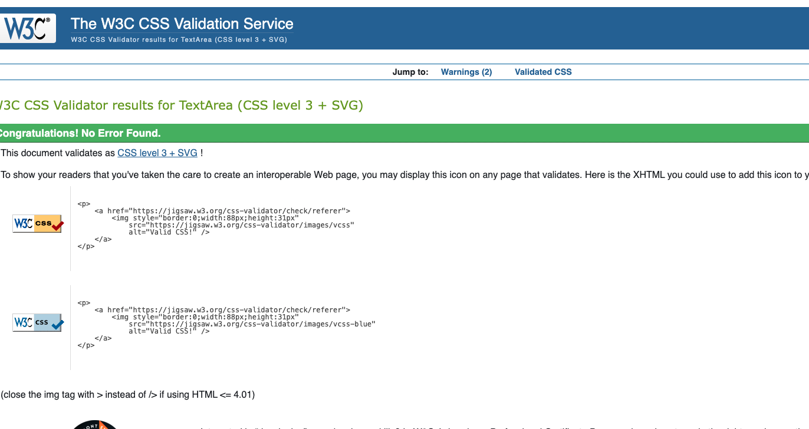

# Testing & Validation

---

## HTML Validation

All HTML pages tested using [W3C HTML Validator](https://validator.w3.org/).

Homepage - PASS

News Page - PASS 

Contact Page - PASS

About Us - PASS

---

## CSS Validation

Tested using [W3C CSS Validator](https://jigsaw.w3.org/css-v)

style.css - PASS

