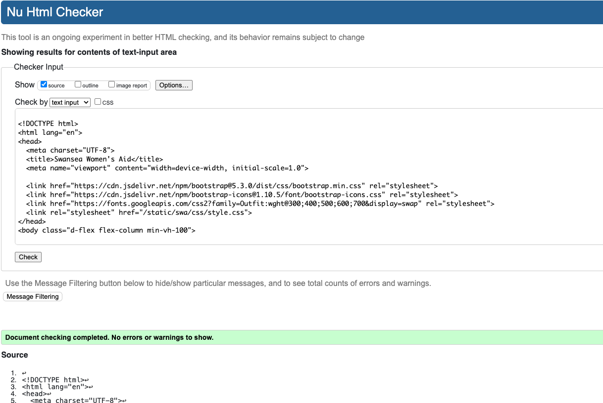
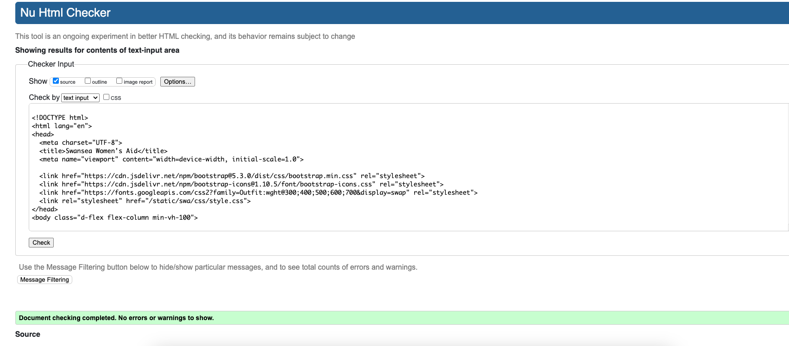

# Testing & Validation

### Overview

Testing was carried out throughout development to ensure functionality, usability, and responsiveness. Due to time constraints and project scope, manual testing was the primary method used.

### Manual Testing

Manual tests were performed on all key features using a range of browsers (Chrome, Firefox, Safari) and devices (laptop, tablet, mobile). The following areas were tested:

| Feature                      | Test Performed                                                                 | Outcome        |
|-----------------------------|----------------------------------------------------------------------------------|----------------|
| Homepage                    | Checked responsiveness and link functionality                                   | Pass ✅         |
| Navigation bar              | Checked visibility, responsiveness, and active links                            | Pass ✅         |
| Blog list & detail pages    | Confirmed posts display correctly, with readable formatting                     | Pass ✅         |
| Admin blog functionality    | Staff users can create, edit, and delete posts via Django admin                 | Pass ✅         |
| Contact form                | Tested required fields and success message upon submission                      | Pass ✅         |
| Stripe donation form        | Verified with test card, handled success/cancel flows                           | Pass ✅         |
| User authentication         | Tested login, logout, restricted page access for unauthenticated users          | Pass ✅         |
| 404 / 500 error pages       | Triggered intentionally to confirm custom error pages are displayed             | Pass ✅         |
| Footer login link           | Confirmed visibility and restricted access only for staff                       | Pass ✅         |

### Stripe Testing

Stripe’s test environment was used with the following test cards:

- **Successful payment**: `4242 4242 4242 4242`
- **Declined card**: `4000 0000 0000 0002`

Both redirect flows and success messages were verified.


## HTML Validation

All HTML pages tested using [W3C HTML Validator](https://validator.w3.org/).

<details>
<summary>Homepage - PASS</summary>


</details>

<details>
<summary>News Page - PASS </summary>


</details>

<details>
<summary>Contact Page - PASS</summary>


</details>

<details>
<summary>Donate - PASS</summary>



</details>

<details>
<summary>About Us - PASS</summary>


</details>

<details>
<summary>Email Thanks - PASS</summary>



</details>


---

## CSS Validation

Tested using [W3C CSS Validator](https://jigsaw.w3.org/css-v)
<details>
<summary>style.css - PASS</summary>


</details>

## Python Unit Testing

To ensure the Django views were functioning correctly, unit tests were written using Django’s built-in `TestCase` class.

### 🔧 Running the Tests

The following command was used to run the tests:

```bash
python manage.py test core
```

### Tests Covered

- Homepage view returns 200  
- About Us view returns 200  
- Contact view returns 200  
- Donate view returns 200  
- News (post list) view returns 200  
- Understanding Abuse view returns 200  

### ✅ Test Output

```
......
----------------------------------------------------------------------
Ran 6 tests in 0.030s

OK
```

All tests passed successfully, confirming that the core pages rendered without error and returned successful responses.


### 🐞 Bug Fix Log

| Bug Description                                               | Fix Summary                                                   |
|---------------------------------------------------------------|---------------------------------------------------------------|
| Navbar links not highlighting current page                    | Added `active` class conditionally using Django template tags |
| Contact form layout breaking on mobile                        | Adjusted Bootstrap grid and padding classes                   |
| Footer links had low contrast and were hard to read           | Changed link color to `text-dark` and removed underline       |
| Duplicate `<main>` tag causing template error                 | Removed nested `<main>` tag for valid HTML structure          |
| Images not showing in README                                  | Corrected Markdown paths to point to `static/images` folder   |
| `core/home.html` template not found                           | Moved template back to `templates/core/` directory            |
| Python tests not running due to indentation error             | Fixed indentation in `tests.py` file                          |

---

### 🚀 Heroku Deployment Debug Report

During deployment to Heroku, I encountered several issues that required troubleshooting and debugging:

#### ⛔ Deployment Failures
- **`ModuleNotFoundError: dj_database_url`** despite being in `requirements.txt`.
- Static files not displaying due to missing `collectstatic` command.
- App crashed on first load due to missing `SECRET_KEY` and incorrect `ALLOWED_HOSTS`.

#### ✅ Fixes Applied
- Reinstalled all dependencies and regenerated `requirements.txt` with `pip freeze`.
- Set environment variables (`SECRET_KEY`, `DATABASE_URL`, `DEBUG=False`) via Heroku dashboard.
- Ran `python manage.py collectstatic` and committed the static files.
- Updated `ALLOWED_HOSTS` to include the live Heroku domain.

---

### 💳 Stripe Integration Issues

#### Problem
- `ModuleNotFoundError: No module named 'stripe'` after initial deploy.
- Stripe threw an `UndefinedValueError` due to a missing `STRIPE_SECRET_KEY`.

#### Solution
- Installed Stripe with `pip install stripe`.
- Added `STRIPE_SECRET_KEY` to the `.env` file and confirmed `python-decouple` was loading it.
- Restarted the server after updating the environment.
- Removed unused import (`donation_thank_you`) that referenced a non-existent view.

---

### 🗓️ Debug Log: Missing Post Timestamp

#### Problem
- Blog post list displayed title and author, but **not** the date/time.

#### Root Cause
- Template was using `{{ post.timestamp }}`, but the model field was `created_on`.

#### Fix
- Updated template to `{{ post.created_on|date:"F j, Y, g:i a" }}` and the date appeared correctly.

---
